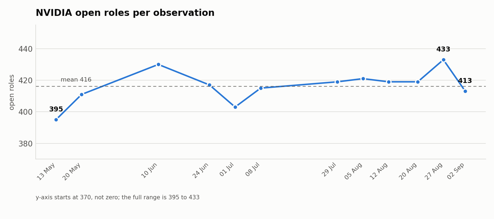
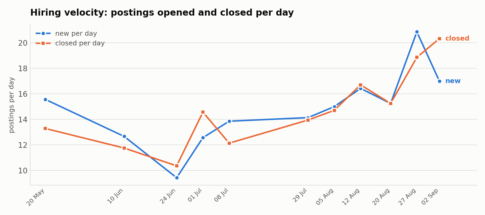
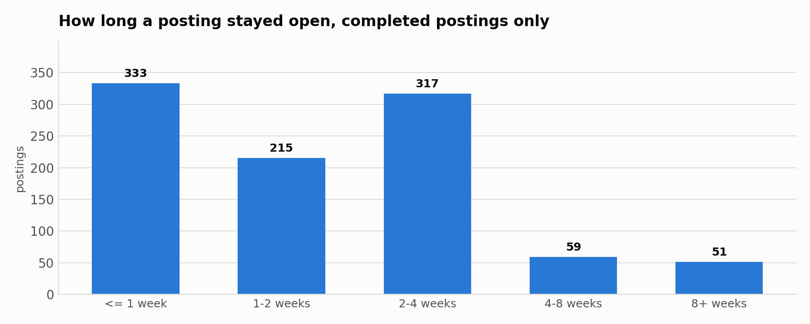
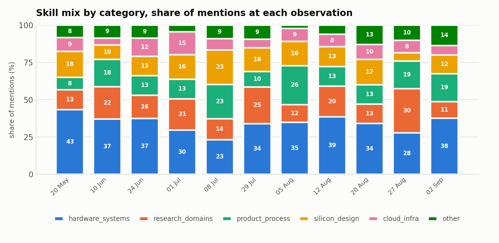

# Hiring Trend Note - NVIDIA

Member: Nayab Khalid
Company: NVIDIA
Task 5: Hiring Trend Analysis
Date: 2026-09-20

## Summary

Across 12 observations from 2026-05-13 to 2026-09-02, NVIDIA's open-role count barely moved:
395 to 413, a net gain of 18 roles, never leaving a band of 395 to 433. The flows underneath it did
move. Postings opened per day rose from about 12 to about 17, and closings rose in step.

**The headline: the stock is flat while the churn is accelerating.** NVIDIA is not expanding its
open-role count; it is turning that list over faster.

| Measure | Value |
|---|---|
| Observations | 12, spanning 112 days |
| Open roles | min 395, max 433, mean 416 |
| Net change over the window | **+18 roles (+4.6%)** |
| New postings per day | mean 14.8, range 9.4 to 20.9 |
| Closed postings per day | mean 14.7, range 10.4 to 20.3 |
| Trend in new per day | **+0.60 per observation** |
| Median time a completed posting stayed open | 14 days |

## 1. Method, and why it is not a plain weekly count

Three properties of the Task 2 data decide how this had to be computed.

**The observation gaps are uneven:** 7, 21, 14, 7, 7, 21, 7, 7, 8, 7 and 6 days, because seven
partial scrapes were excluded in Task 2. Counting arrivals per observation would turn the two
21-day gaps into fake hiring spikes: they show 266 and 297 arrivals against a typical 100 to 120.
Normalised per day they are 12.7 and 14.1, sitting exactly among their neighbours. **Every flow in
this task is therefore a per-day rate**, with the raw counts kept alongside so the normalisation is
visible rather than hidden.

**The stock is observed; the flows are derived.** Open roles on a date is a direct count from that
day's snapshot. New and closed are set differences between consecutive snapshots, so they inherit
whatever happened inside the gap. Where the two disagree, the stock is the more trustworthy series.

**Both ends are censored.** The 395 postings already open at the first observation are stamped with
that date, so the first period's "arrivals" are not arrivals; that period is dropped from all flow
analysis. At the other end, 413 postings were still open, so their lifespans are unknown rather
than short.

This matches the team's shared config on weekly buckets and zero-filled empty periods, with the
per-day normalisation added because our gaps are not uniform. **That addition needs raising with the
team**, since any member with a gapped series has the same problem.

## 2. Open roles: flat



The series sits in a 38-role band for four months. The only visible move is a rise to 433 on 27
August followed by a fall to 413 a week later, and at a mean of 416 that is a 5% wobble, not a
trend.

If the question is "is NVIDIA expanding?", the answer from this window is no. The open-role count is
being held roughly constant.

## 3. Hiring velocity: accelerating



| Observation | Gap (days) | New | Closed | New/day | Closed/day | Net/day |
|---|---|---|---|---|---|---|
| 2026-05-20 | 7 | 109 | 93 | 15.57 | 13.29 | +2.29 |
| 2026-06-10 | 21 | 266 | 247 | 12.67 | 11.76 | +0.90 |
| 2026-06-24 | 14 | 132 | 145 | 9.43 | 10.36 | -0.93 |
| 2026-07-01 | 7 | 88 | 102 | 12.57 | 14.57 | -2.00 |
| 2026-07-08 | 7 | 97 | 85 | 13.86 | 12.14 | +1.71 |
| 2026-07-29 | 21 | 297 | 293 | 14.14 | 13.95 | +0.19 |
| 2026-08-05 | 7 | 105 | 103 | 15.00 | 14.71 | +0.29 |
| 2026-08-12 | 7 | 115 | 117 | 16.43 | 16.71 | -0.29 |
| 2026-08-20 | 8 | 122 | 122 | 15.25 | 15.25 | 0.00 |
| 2026-08-27 | 7 | 146 | 132 | 20.86 | 18.86 | +2.00 |
| 2026-09-02 | 6 | 102 | 122 | 17.00 | 20.33 | -3.33 |

Three things stand out.

**The two lines track each other closely.** Net change per day never exceeds 3.3 in either
direction. Postings are replaced at almost exactly the rate they leave.

**Both rates rise together.** The three-observation rolling mean of new-per-day goes from 14.1 in
June to 17.7 at the start of September, a rise of about 25%. Closings follow the same path. A
company adding headcount would show new outrunning closed; these move in lockstep.

**The trough is late June.** New-per-day bottoms at 9.4 on 24 June, the only observation where the
rate drops below 10, and it is the same period where net change is most negative. Whether that is a
real summer pause or a collection artefact cannot be settled from one occurrence.

## 4. How long a posting stays open



| Bucket | Postings | Share |
|---|---|---|
| 1 week or less | 333 | 34.2% |
| 1 to 2 weeks | 215 | 22.1% |
| 2 to 4 weeks | 317 | 32.5% |
| 4 to 8 weeks | 59 | 6.1% |
| 8 weeks or more | 51 | 5.2% |

Median 14 days across 975 completed postings. A third are gone within a week.

**This is quantised by the sampling cadence** and must be read that way: a posting observed once has
a measured span of 0 days, twice a week apart has 7. The buckets are really "how many observations
it survived", so the shape is trustworthy and the precise values are not. The 413 postings still
open on 2 September are excluded rather than counted as short-lived.

A short median is consistent either with roles being filled quickly or with postings being relisted
under new identifiers. **Closed does not mean filled.** Nothing in this data distinguishes a filled
role from a cancelled or re-posted one, and no conclusion here assumes otherwise.

## 5. What is being hired for, and how that shifted



| Category | First observation | Last observation | Direction |
|---|---|---|---|
| hardware_systems | 36.6% | 37.5% | flat |
| product_process | 13.7% | 18.8% | **up** |
| research_domains | 16.1% | 11.3% | **down** |
| silicon_design | 15.2% | 12.5% | down |
| cloud_infra | 8.9% | 6.3% | down |
| other | 9.4% | 13.8% | up |

Hardware and systems hold a steady third of all skill mentions throughout: that is NVIDIA's centre
of gravity and it does not move. The visible rotation is out of research domains and into
product and go-to-market roles, which sits alongside the Task 4 finding that Solutions Architecture
is the single largest skill in the corpus at 192 postings.

The chart plots **share, not counts**, deliberately. A count chart would be dominated by the
censored first observation and the two 21-day gaps, showing the sampling pattern instead of the
hiring mix.

## 6. Key patterns, stated plainly

1. **Flat stock, accelerating churn.** Open roles +4.6% over four months while both flow rates rose
   about 25%. NVIDIA is replacing roles faster, not adding them.
2. **Replacement, not expansion.** New and closed track within 3.3 postings per day of each other at
   every single observation.
3. **Hardware is the constant.** A steady 37% of skill mentions, unmoved across the window.
4. **The rotation is toward the field.** Product and go-to-market up 5 points, research down 5.
5. **Postings turn over quickly.** Median 14 days open, a third gone inside a week.

## 7. Limitations

1. **Eleven usable flow periods.** After dropping the censored first observation, the trend rests on
   11 intervals with uneven gaps. It shows direction, not magnitude, and cannot support seasonality.
2. **Four months is not a business cycle.** May to September includes one summer, and the late-June
   trough cannot be separated from a seasonal effect with a single year of data.
3. **Closed is not filled**, as set out in section 4.
4. **European bias.** The Task 2 source curates EU-office employers, so this is NVIDIA's European
   hiring rather than global. The flat stock may not hold worldwide.
5. **Lifespans are quantised** to the observation cadence.
6. **Skill mix inherits the Task 4 ceiling**: titles carry about one skill each, so the mix is
   coarser than a description-based one would be.

## 8. For the team

1. **Agree per-day normalisation for gapped series.** Anyone whose collection missed days has the
   same distortion. Raw per-observation counts are not comparable across members with different
   cadences.
2. **Agree how to treat censored first observations**, so Task 6 does not compare my de-censored
   series against someone's raw one.
3. **Stock versus flow needs one definition.** I can report both. A member collecting only current
   openings has a stock series alone and no flows, and Task 6 must compare like with like.

## Files

| File | Contents |
|---|---|
| `data/trends/nvidia_weekly_trend_20260902.csv` | The main trend table: stock, flows, per-day rates, rolling mean |
| `data/trends/nvidia_category_mix_20260902.csv` | Skill mentions by category at each observation |
| `data/trends/nvidia_lifespan_20260902.csv` | Lifespan distribution for completed postings |
| `figures/fig1_open_roles.png` … `fig4_lifespan.png` | The four figures above |
| `analyse_trends.py` | The analysis, re-runnable from a clean checkout |

Reproduce with:

```bash
cd work/task-5/nvidia-nayab-khalid
python analyse_trends.py
```
