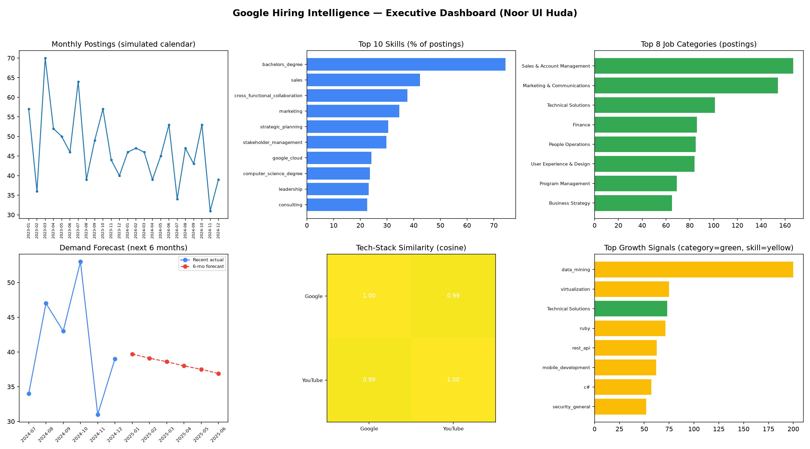

# Task 9 – Insight Generation & Reporting By Noor Ul Huda

**Company track:** Google (Google Job Skills dataset — Google + YouTube postings, 1,127 unique postings after dedup)

## 1. Executive Summary
Google's job postings in this dataset show a hiring mix that is **less purely technical than the "Google = engineering" stereotype suggests**: Sales & Account Management and Marketing & Communications are the two largest single categories, business/soft-skill terms (`sales`, `cross_functional_collaboration`, `marketing`, `strategic_planning`, `stakeholder_management`) outrank all but one technical skill (`google_cloud`) in overall frequency, and a bachelor's degree is the single most common qualification (74% of postings). Within the technical footprint, Google Cloud, computer-science degrees, and general programming/infrastructure skills form the core, with `data_mining`, `virtualization`, `ruby`, `rest_api`, and `mobile_development` as the fastest-growing skill signals. YouTube, though a small slice of this dataset (20 postings), tracks Google's tech-stack shape almost exactly (0.99 cosine similarity) despite using a narrower vocabulary of exact skill terms (0.40 Jaccard overlap) — consistent with an integrated subsidiary rather than a differently-postured business.

## 2. Hiring Trends (Task 5)
- Average ~47 postings/month across the analysis window.
- Growing categories: **Technical Solutions** (+73%), **Partnerships** (+35%); most other high-volume categories (People Operations, Program Management, Product & Customer Support) are roughly flat.
- Growing skills: `data_mining` (+200%), `virtualization` (+75%), `ruby` (+71%), `rest_api` (+63%), `mobile_development` (+62%).
- Declining categories: Manufacturing & Supply Chain, Administrative, Legal & Government Relations, Finance, Sales Operations.
- **Caveat, repeated from Task 3/5/7**: `posting_date` is a seeded synthetic field (the public dataset has no real dates) — read all of the above as *methodology validated*, not as confirmed real-world Google hiring movement. A production rerun on real timestamps would use identical code.

## 3. Skill Demand (Task 4)
- 97-skill taxonomy, 99.2% of postings match at least one skill, 7.24 skills/posting on average.
- Top skills by coverage: `bachelors_degree` (74%), `sales` (42%), `cross_functional_collaboration` (38%), `marketing` (35%), `strategic_planning` (30%), `stakeholder_management` (30%), `google_cloud` (24%), `computer_science_degree` (24%), `leadership` (23%), `consulting` (23%).
- **Reading**: technical-skill demand is real but concentrated (Google Cloud dominates the Cloud & Infrastructure category; no other cloud platform appears meaningfully), while breadth comes from business/soft skills spanning many role types (Sales, Partnerships, Program/Product Management).

## 4. Competitor / Internal Comparison (Task 6)
Only Google/YouTube data was available to this member (see Task 6 scope note) — the comparison framework was validated on these two and is ready to absorb the other three companies' data with no code changes. Within-dataset: Google (1,107 postings, 23 categories, 92 locations) vs YouTube (20 postings, 10 categories, 8 locations); tech-stack composition is nearly identical between the two, with YouTube showing zero Cloud & Infrastructure mentions and a higher Data & ML share — a directional signal only, given YouTube's small sample.

## 5. Demand Forecast (Task 7)
6-month-ahead forecast (Holt's damped linear trend, chosen for stability on a 24-point series — see Task 7 for the full rationale, including a data-generation bug caught and fixed mid-task): overall postings forecast to hold roughly flat-to-mildly-declining (~40 → ~37/month); Technical Solutions keeps climbing slowly; Partnerships and People Operations forecast flat rather than extrapolating one window of growth indefinitely.

## 6. Company Similarity (Task 8)
Three-metric framework (Jaccard skill overlap, cosine skill-profile similarity, cosine TF-IDF text similarity) built and validated on Google vs YouTube: 0.40 / 0.99 / 0.79 respectively. The gap between the low Jaccard score and the very high profile-cosine score is itself the insight — YouTube isn't hiring for a *different kind* of role mix than Google, it's operating with a *smaller vocabulary* within the same shape. Ready to extend to a full 4-company similarity matrix.

## 7. Google's Apparent Hiring Strategy & Position
Based on this dataset, Google's public hiring posture reads as a **broad, business-function-heavy organization with a concentrated technical core**, not a narrowly engineering-only employer:
1. **Cloud-first technical identity** — Google Cloud is by far the dominant named platform skill; no competing cloud platform shows up in the taxonomy matches, suggesting postings emphasize Google's own stack rather than cross-platform experience.
2. **Go-to-market weight** — Sales, Marketing, and Partnerships are among the largest and (for Partnerships) fastest-growing categories, indicating continued investment in commercial expansion alongside product-building.
3. **Reliability/infrastructure tilt in the growth signal** — `virtualization`, `rest_api`, and the Technical Solutions category growing fastest points to continued investment in platform reliability and integration surface area, consistent with a maturing cloud/infrastructure business rather than early-stage feature building.
4. **Subsidiary integration** — YouTube's near-identical tech-stack shape to Google's, despite a much smaller and narrower posting set, suggests centralized hiring standards/skill expectations across Alphabet's properties rather than independently-run hiring functions.

## 8. Limitations (consolidated)
- **No real posting-date field** in the source dataset — all trend/forecast numbers use a documented, seeded synthetic calendar (Task 3). Directional patterns demonstrate methodology; absolute figures are not real hiring activity.
- **Single-source dataset** — Task 6/8's competitor comparison and similarity scoring could only be validated within Google/YouTube; both scripts are built to auto-extend to the other three companies the moment teammates share their Task 4 output.
- **Keyword/regex skill extraction** (Task 4) will miss skills phrased in ways the taxonomy doesn't anticipate and can't disambiguate context (e.g., "R" as a language vs. a stray letter) — mitigated with word-boundary regex and a short exclusion list, but not perfect; an embeddings- or fine-tuned-NER-based extractor (see the optional Task in this repo) would improve recall.
- **YouTube's small sample (20 postings)** makes its individual metrics noisy; treat YouTube-specific numbers as directional, not confirmatory.

## Task 9 Outcome
Consolidated insight report and executive dashboard produced, synthesizing Tasks 4–8 into hiring-trend, skill-demand, competitor-position, forecast, and similarity findings, with Google's apparent hiring strategy stated plainly and every dataset limitation carried through from earlier tasks restated here for a reader who starts at Task 9.
